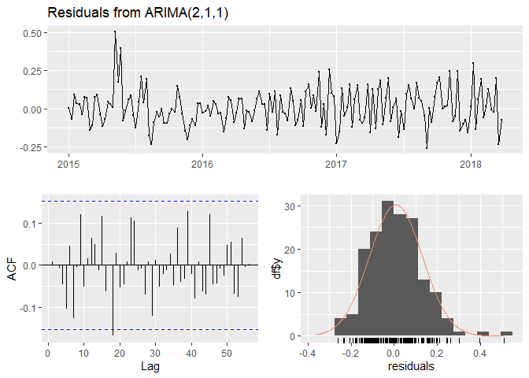
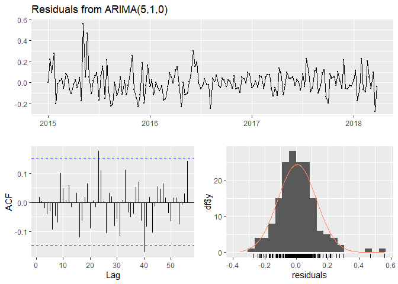

Which city in the US has the cheapest Avocado?
================
Kar Ng
2021

-   [1 SUMMARY](#1-summary)
-   [2 R PACKAGES](#2-r-packages)
-   [3 SCENARIO AND BUSINESS
    QUESTIONS](#3-scenario-and-business-questions)
-   [4 Data PREPARATION](#4-data-preparation)
    -   [4.1 Data import](#41-data-import)
    -   [4.2 Data description](#42-data-description)
    -   [4.3 Data exploration](#43-data-exploration)
-   [5 DATA INTEGRITY ASSESSMENT](#5-data-integrity-assessment)
    -   [5.1 “Unit” problems in the data](#51-unit-problems-in-the-data)
    -   [5.2 Is the data ROCCC?](#52-is-the-data-roccc)
-   [6 DATA CLEANING AND
    MANIPULATION](#6-data-cleaning-and-manipulation)
    -   [6.1 Convert column names to lower and snake
        case](#61-convert-column-names-to-lower-and-snake-case)
    -   [6.2 Renaming the “4046”, ”4225“,
        and”4770"](#62-renaming-the-4046-4225-and4770)
    -   [6.3 Removing unwanted columns](#63-removing-unwanted-columns)
    -   [6.4 Removing decimal places](#64-removing-decimal-places)
    -   [6.5 Data type conversion](#65-data-type-conversion)
    -   [6.6 Managing the messy “region”
        data](#66-managing-the-messy-region-data)
    -   [6.7 Synthesise metric](#67-synthesise-metric)
-   [7 EXPLORATORY DATA ANALYSIS](#7-exploratory-data-analysis)
    -   [7.1 Move to Houston?](#71-move-to-houston)
    -   [7.2 Where are my avocado
        fellows?](#72-where-are-my-avocado-fellows)
    -   [7.3 How is the organic avocado
        consumption?](#73-how-is-the-organic-avocado-consumption)
        -   [7.3.1 Consumption of organic avocado in the
            US](#731-consumption-of-organic-avocado-in-the-us)
        -   [7.3.2 Consumption of organic avocado in the top 10
            consumption cities in the
            US](#732-consumption-of-organic-avocado-in-the-top-10-consumption-cities-in-the-us)
    -   [7.4 How are people buying their avocados in the
        US?](#74-how-are-people-buying-their-avocados-in-the-us)
    -   [7.5 How are people buying their avocado in
        Houston?](#75-how-are-people-buying-their-avocado-in-houston)
-   [8 Predicting Avocado price in
    Houston](#8-predicting-avocado-price-in-houston)
    -   [8.1 Forecast: Non-organic Avocado prices in
        US](#81-forecast-non-organic-avocado-prices-in-us)
    -   [8.2 Forecast: Organic Avocado prices in
        US](#82-forecast-organic-avocado-prices-in-us)
    -   [8.3 Forecast: Non-organic Avocado prices in
        Houston](#83-forecast-non-organic-avocado-prices-in-houston)
    -   [8.4 Forecast: Organic Avocado prices in
        Houston](#84-forecast-organic-avocado-prices-in-houston)
-   [9 CONCLUSION](#9-conclusion)
-   [10 LEGALITY](#10-legality)
-   [11 REFERENCE](#11-reference)

------------------------------------------------------------------------


------------------------------------------------------------------------

Reading time: 29 minutes

## 1 SUMMARY

This is a personal side project using an avocado public data set
introduced in the 6-month extensive Google Data Analytics Professional
Certificate program. The goal of this project is to identify which city
in the US has the cheapest avocado and is the price able to fit within a
budget of $800 a year with a consumption rate of minimum 1 avocado per
day. Another goal is to predict the trend of avocado prices, organic and
non-organic, in the future 24 months and hopefully their prices in the
chosen city remain budget-friendly.

Numerous graphs were created during EDA and prediction, include box
plots, tree maps, bar charts, pie charts, different types of time plot
(general, differences, sub-series), plots for ACF-Log, histograms for
normality and forecasting graphs. Forecasting touches on seasonality and
stationary tests using pp-test, wo-test, and autocorrrelation test using
Ljung-Box test. There are 4 forecasting activities on predicting the
price of non-organic and organic avocado prices in the US, as well as in
the city of chosen in the next 24 months.

Results reveal that 97% of avocados in the US were sold as non-organic
avocado, and 3% as organic. Most popular avocados are small and medium
size (PLU4225). Picking Houston as the city of first preference to move
to as the city is the second cheapest non-organic avocado city, the
cheapest organic avocado city, and the top 10 most avocado-consuming
cities. From my forecast, 95% of non-organic avocado prices in Houston
will fall below my threshold of 2 dollars per avocado, but for organic
avocado, 95% of chance that the price may exceed 2 dollars after 2019.
Base on this data set and results, I will move to Houston, consume
organic avocado until the end of 2019, then switch to non-organic ones.
These conditions fulfilled my desire of at least 1 avocado per day and
not exceeding threshold of $800 per year, and in the same time being
environmental friendlier.


## 2 R PACKAGES

R packages loaded in this projects include tidyverse packages (ggplot2,
dplyr, tidyr, readr, purrr, tibble, stringr, and forcats), skimr,
lubridate, kableExtra, ggrepel, hms, treemapify, fpp2, and seastests.

``` r
library(tidyverse)
library(skimr)
library(lubridate)
library(kableExtra)
library(ggrepel)
library(hms)
library(treemapify)
library(fpp2)
library(seastests)
```

## 3 SCENARIO AND BUSINESS QUESTIONS

In this scenario - (1) I am an avocado lover, (2) I must consume minimum
of 1 avocado per day, and (3) I am migrating to US next year to
experience US life.


I would like to move to a US city with cheap avocado. Despite I would
like to eat as more avocado as possible but I still have a budget of
$800 per year allocated for avocado consumption.

In my plan, I would like find out the top-5 cities where have the
cheapest avocado and hopefully the price remains similar in the next 2
years. It will be great if I can contribute something for the
environment by eating organic avocado. Of course, if the organic avocado
price is within my budget.

I hope this project can give me some insightful answers!

## 4 Data PREPARATION

Data set used in this personal project has an official name known as
“Avocado Prices”. The data set was introduced by the 6-month extensive
Google Professional Data Analytics Certificate that I completed on 31
May 2021. This data set was used by the program in a few parts of its
data analysis activities.

Instructed by the Google program, the data set was downloaded from
*Kaggle*. Kaggle is a great website for data science community, [click
this link to the page of the
dataset](https://www.kaggle.com/neuromusic/avocado-prices). The data set
was created and uploaded by Justin Kiggins onto Kaggle and the data was
originally from the Hass Avocado Board website in May 2018, [click here
to the Hass Avocado Board website](https://hassavocadoboard.com/).

### 4.1 Data import

This section imports the “Avocado Price” data set into R with a given
data set name called “avocado”. Following table shows the first 10,000
rows of raw data within the data set.

``` r
avocado <- read_csv("avocado.csv")
head(avocado)
```

    ## # A tibble: 6 x 14
    ##    ...1 Date       AveragePrice `Total Volume` `4046`  `4225` `4770` `Total Bags`
    ##   <dbl> <date>            <dbl>          <dbl>  <dbl>   <dbl>  <dbl>        <dbl>
    ## 1     0 2015-12-27         1.33         64237.  1037.  54455.   48.2        8697.
    ## 2     1 2015-12-20         1.35         54877.   674.  44639.   58.3        9506.
    ## 3     2 2015-12-13         0.93        118220.   795. 109150.  130.         8145.
    ## 4     3 2015-12-06         1.08         78992.  1132   71976.   72.6        5811.
    ## 5     4 2015-11-29         1.28         51040.   941.  43838.   75.8        6184.
    ## 6     5 2015-11-22         1.26         55980.  1184.  48068.   43.6        6684.
    ## # ... with 6 more variables: Small Bags <dbl>, Large Bags <dbl>,
    ## #   XLarge Bags <dbl>, type <chr>, year <dbl>, region <chr>

### 4.2 Data description

The data set contains important information such as dates, avocado
average prices, amounts sold, 3 PLU codes of avocados, type of the
produce and associated region. Check out following table for these
details. The information in the description column are from *Kaggle*.

``` r
Variable <- c("X1",
              "Date",
              "AveragePrice",
              "Total Volume",
              "4046",
              "4225",
              "4770",
              "Total Bags",
              "Small Bags",
              "Large Bags",
              "XLarge Bags",
              "type",
              "year",
              "region")

Description <- c("Index",
                 "The date of the observation",
                 "The average price of a single avocado, even when multiple avocados are sold in bags",
                 "Total number of avocados sold",
                 "Total number of avocados sold by 4046, it is a Product Lookup (PLU) code",
                 "Total number of avocados sold by 4225, it is a Product Lookup (PLU) code",
                 "Total number of avocados sold by 4770, it is a Product Lookup (PLU) code",
                 "Missing information (Kar: The unit is actually per avocado instead of per bag- see section 5)",
                 "Missing information (Kar:  The unit is actually per avocado, see section 5)",
                 "Missing information (Kar: It should be the total number of avocado sold, not number of bags, see section 5)",
                 "Missing information (Kar: It should be the total number of avocado sold, not number of bags, see section 5)",
                 "conventional or organic",
                 "the year",
                 "the city or region of the observation")

data.frame(Variable, Description) %>% 
  kbl(align = "l", 
      table.attr = "style = 'width: 60;'") %>% 
  kable_styling(bootstrap_options = c("hover",
                                      "bordered",
                                      "striped"))
```

<table style="width: 60; margin-left: auto; margin-right: auto;" class="table table-hover table-bordered table-striped">
<thead>
<tr>
<th style="text-align:left;">
Variable
</th>
<th style="text-align:left;">
Description
</th>
</tr>
</thead>
<tbody>
<tr>
<td style="text-align:left;">
X1
</td>
<td style="text-align:left;">
Index
</td>
</tr>
<tr>
<td style="text-align:left;">
Date
</td>
<td style="text-align:left;">
The date of the observation
</td>
</tr>
<tr>
<td style="text-align:left;">
AveragePrice
</td>
<td style="text-align:left;">
The average price of a single avocado, even when multiple avocados are
sold in bags
</td>
</tr>
<tr>
<td style="text-align:left;">
Total Volume
</td>
<td style="text-align:left;">
Total number of avocados sold
</td>
</tr>
<tr>
<td style="text-align:left;">
4046
</td>
<td style="text-align:left;">
Total number of avocados sold by 4046, it is a Product Lookup (PLU) code
</td>
</tr>
<tr>
<td style="text-align:left;">
4225
</td>
<td style="text-align:left;">
Total number of avocados sold by 4225, it is a Product Lookup (PLU) code
</td>
</tr>
<tr>
<td style="text-align:left;">
4770
</td>
<td style="text-align:left;">
Total number of avocados sold by 4770, it is a Product Lookup (PLU) code
</td>
</tr>
<tr>
<td style="text-align:left;">
Total Bags
</td>
<td style="text-align:left;">
Missing information (Kar: The unit is actually per avocado instead of
per bag- see section 5)
</td>
</tr>
<tr>
<td style="text-align:left;">
Small Bags
</td>
<td style="text-align:left;">
Missing information (Kar: The unit is actually per avocado, see section
5)
</td>
</tr>
<tr>
<td style="text-align:left;">
Large Bags
</td>
<td style="text-align:left;">
Missing information (Kar: It should be the total number of avocado sold,
not number of bags, see section 5)
</td>
</tr>
<tr>
<td style="text-align:left;">
XLarge Bags
</td>
<td style="text-align:left;">
Missing information (Kar: It should be the total number of avocado sold,
not number of bags, see section 5)
</td>
</tr>
<tr>
<td style="text-align:left;">
type
</td>
<td style="text-align:left;">
conventional or organic
</td>
</tr>
<tr>
<td style="text-align:left;">
year
</td>
<td style="text-align:left;">
the year
</td>
</tr>
<tr>
<td style="text-align:left;">
region
</td>
<td style="text-align:left;">
the city or region of the observation
</td>
</tr>
</tbody>
</table>

According to the [Hass Avocado Board
website](https://loveonetoday.com/how-to/identify-hass-avocados/), 3 of
the above mentioned Product Lookup (PLU) codes are:

``` r
PLU <- c("4046", "4225", "4770")
Category <- c("Small/Medium Hass Avocado (~3-5oz avocado)", 
              "Large Hass Avocado (~8-10oz avocado)",
              "Extra Large Hass Avocado (~10-15oz avocado)")

data.frame(PLU, Category) %>% 
  kbl(align = "l",
      table.attr = "style = 'width: 40;'") %>% 
  kable_classic(c("hover", "condense"))
```

<table style="width: 40; font-family: &quot;Arial Narrow&quot;, &quot;Source Sans Pro&quot;, sans-serif; margin-left: auto; margin-right: auto;" class=" lightable-classic lightable-hover">
<thead>
<tr>
<th style="text-align:left;">
PLU
</th>
<th style="text-align:left;">
Category
</th>
</tr>
</thead>
<tbody>
<tr>
<td style="text-align:left;">
4046
</td>
<td style="text-align:left;">
Small/Medium Hass Avocado (\~3-5oz avocado)
</td>
</tr>
<tr>
<td style="text-align:left;">
4225
</td>
<td style="text-align:left;">
Large Hass Avocado (\~8-10oz avocado)
</td>
</tr>
<tr>
<td style="text-align:left;">
4770
</td>
<td style="text-align:left;">
Extra Large Hass Avocado (\~10-15oz avocado)
</td>
</tr>
</tbody>
</table>

### 4.3 Data exploration

This data set has 18,249 rows of data (or known as observation) and 14
variables. It has 1 character column, 1 date and 11 numeric columns.

-   Following data summary table group these variables into different
    chunks with examples from the data set.
-   This table **n\_missing** and **complete\_rate** information to tell
    completeness within eac variable.

------------------------------------------------------------------------

``` r
skim_without_charts(avocado)
```

<table style="width: auto;" class="table table-condensed">
<caption>
Data summary
</caption>
<thead>
<tr>
<th style="text-align:left;">
</th>
<th style="text-align:left;">
</th>
</tr>
</thead>
<tbody>
<tr>
<td style="text-align:left;">
Name
</td>
<td style="text-align:left;">
avocado
</td>
</tr>
<tr>
<td style="text-align:left;">
Number of rows
</td>
<td style="text-align:left;">
18249
</td>
</tr>
<tr>
<td style="text-align:left;">
Number of columns
</td>
<td style="text-align:left;">
14
</td>
</tr>
<tr>
<td style="text-align:left;">
\_\_\_\_\_\_\_\_\_\_\_\_\_\_\_\_\_\_\_\_\_\_\_
</td>
<td style="text-align:left;">
</td>
</tr>
<tr>
<td style="text-align:left;">
Column type frequency:
</td>
<td style="text-align:left;">
</td>
</tr>
<tr>
<td style="text-align:left;">
character
</td>
<td style="text-align:left;">
2
</td>
</tr>
<tr>
<td style="text-align:left;">
Date
</td>
<td style="text-align:left;">
1
</td>
</tr>
<tr>
<td style="text-align:left;">
numeric
</td>
<td style="text-align:left;">
11
</td>
</tr>
<tr>
<td style="text-align:left;">
\_\_\_\_\_\_\_\_\_\_\_\_\_\_\_\_\_\_\_\_\_\_\_\_
</td>
<td style="text-align:left;">
</td>
</tr>
<tr>
<td style="text-align:left;">
Group variables
</td>
<td style="text-align:left;">
None
</td>
</tr>
</tbody>
</table>

**Variable type: character**

<table>
<thead>
<tr>
<th style="text-align:left;">
skim\_variable
</th>
<th style="text-align:right;">
n\_missing
</th>
<th style="text-align:right;">
complete\_rate
</th>
<th style="text-align:right;">
min
</th>
<th style="text-align:right;">
max
</th>
<th style="text-align:right;">
empty
</th>
<th style="text-align:right;">
n\_unique
</th>
<th style="text-align:right;">
whitespace
</th>
</tr>
</thead>
<tbody>
<tr>
<td style="text-align:left;">
type
</td>
<td style="text-align:right;">
0
</td>
<td style="text-align:right;">
1
</td>
<td style="text-align:right;">
7
</td>
<td style="text-align:right;">
12
</td>
<td style="text-align:right;">
0
</td>
<td style="text-align:right;">
2
</td>
<td style="text-align:right;">
0
</td>
</tr>
<tr>
<td style="text-align:left;">
region
</td>
<td style="text-align:right;">
0
</td>
<td style="text-align:right;">
1
</td>
<td style="text-align:right;">
4
</td>
<td style="text-align:right;">
19
</td>
<td style="text-align:right;">
0
</td>
<td style="text-align:right;">
54
</td>
<td style="text-align:right;">
0
</td>
</tr>
</tbody>
</table>

**Variable type: Date**

<table>
<thead>
<tr>
<th style="text-align:left;">
skim\_variable
</th>
<th style="text-align:right;">
n\_missing
</th>
<th style="text-align:right;">
complete\_rate
</th>
<th style="text-align:left;">
min
</th>
<th style="text-align:left;">
max
</th>
<th style="text-align:left;">
median
</th>
<th style="text-align:right;">
n\_unique
</th>
</tr>
</thead>
<tbody>
<tr>
<td style="text-align:left;">
Date
</td>
<td style="text-align:right;">
0
</td>
<td style="text-align:right;">
1
</td>
<td style="text-align:left;">
2015-01-04
</td>
<td style="text-align:left;">
2018-03-25
</td>
<td style="text-align:left;">
2016-08-14
</td>
<td style="text-align:right;">
169
</td>
</tr>
</tbody>
</table>

**Variable type: numeric**

<table>
<thead>
<tr>
<th style="text-align:left;">
skim\_variable
</th>
<th style="text-align:right;">
n\_missing
</th>
<th style="text-align:right;">
complete\_rate
</th>
<th style="text-align:right;">
mean
</th>
<th style="text-align:right;">
sd
</th>
<th style="text-align:right;">
p0
</th>
<th style="text-align:right;">
p25
</th>
<th style="text-align:right;">
p50
</th>
<th style="text-align:right;">
p75
</th>
<th style="text-align:right;">
p100
</th>
</tr>
</thead>
<tbody>
<tr>
<td style="text-align:left;">
…1
</td>
<td style="text-align:right;">
0
</td>
<td style="text-align:right;">
1
</td>
<td style="text-align:right;">
24.23
</td>
<td style="text-align:right;">
15.48
</td>
<td style="text-align:right;">
0.00
</td>
<td style="text-align:right;">
10.00
</td>
<td style="text-align:right;">
24.00
</td>
<td style="text-align:right;">
38.00
</td>
<td style="text-align:right;">
52.00
</td>
</tr>
<tr>
<td style="text-align:left;">
AveragePrice
</td>
<td style="text-align:right;">
0
</td>
<td style="text-align:right;">
1
</td>
<td style="text-align:right;">
1.41
</td>
<td style="text-align:right;">
0.40
</td>
<td style="text-align:right;">
0.44
</td>
<td style="text-align:right;">
1.10
</td>
<td style="text-align:right;">
1.37
</td>
<td style="text-align:right;">
1.66
</td>
<td style="text-align:right;">
3.25
</td>
</tr>
<tr>
<td style="text-align:left;">
Total Volume
</td>
<td style="text-align:right;">
0
</td>
<td style="text-align:right;">
1
</td>
<td style="text-align:right;">
850644.01
</td>
<td style="text-align:right;">
3453545.36
</td>
<td style="text-align:right;">
84.56
</td>
<td style="text-align:right;">
10838.58
</td>
<td style="text-align:right;">
107376.76
</td>
<td style="text-align:right;">
432962.29
</td>
<td style="text-align:right;">
62505646.52
</td>
</tr>
<tr>
<td style="text-align:left;">
4046
</td>
<td style="text-align:right;">
0
</td>
<td style="text-align:right;">
1
</td>
<td style="text-align:right;">
293008.42
</td>
<td style="text-align:right;">
1264989.08
</td>
<td style="text-align:right;">
0.00
</td>
<td style="text-align:right;">
854.07
</td>
<td style="text-align:right;">
8645.30
</td>
<td style="text-align:right;">
111020.20
</td>
<td style="text-align:right;">
22743616.17
</td>
</tr>
<tr>
<td style="text-align:left;">
4225
</td>
<td style="text-align:right;">
0
</td>
<td style="text-align:right;">
1
</td>
<td style="text-align:right;">
295154.57
</td>
<td style="text-align:right;">
1204120.40
</td>
<td style="text-align:right;">
0.00
</td>
<td style="text-align:right;">
3008.78
</td>
<td style="text-align:right;">
29061.02
</td>
<td style="text-align:right;">
150206.86
</td>
<td style="text-align:right;">
20470572.61
</td>
</tr>
<tr>
<td style="text-align:left;">
4770
</td>
<td style="text-align:right;">
0
</td>
<td style="text-align:right;">
1
</td>
<td style="text-align:right;">
22839.74
</td>
<td style="text-align:right;">
107464.07
</td>
<td style="text-align:right;">
0.00
</td>
<td style="text-align:right;">
0.00
</td>
<td style="text-align:right;">
184.99
</td>
<td style="text-align:right;">
6243.42
</td>
<td style="text-align:right;">
2546439.11
</td>
</tr>
<tr>
<td style="text-align:left;">
Total Bags
</td>
<td style="text-align:right;">
0
</td>
<td style="text-align:right;">
1
</td>
<td style="text-align:right;">
239639.20
</td>
<td style="text-align:right;">
986242.40
</td>
<td style="text-align:right;">
0.00
</td>
<td style="text-align:right;">
5088.64
</td>
<td style="text-align:right;">
39743.83
</td>
<td style="text-align:right;">
110783.37
</td>
<td style="text-align:right;">
19373134.37
</td>
</tr>
<tr>
<td style="text-align:left;">
Small Bags
</td>
<td style="text-align:right;">
0
</td>
<td style="text-align:right;">
1
</td>
<td style="text-align:right;">
182194.69
</td>
<td style="text-align:right;">
746178.51
</td>
<td style="text-align:right;">
0.00
</td>
<td style="text-align:right;">
2849.42
</td>
<td style="text-align:right;">
26362.82
</td>
<td style="text-align:right;">
83337.67
</td>
<td style="text-align:right;">
13384586.80
</td>
</tr>
<tr>
<td style="text-align:left;">
Large Bags
</td>
<td style="text-align:right;">
0
</td>
<td style="text-align:right;">
1
</td>
<td style="text-align:right;">
54338.09
</td>
<td style="text-align:right;">
243965.96
</td>
<td style="text-align:right;">
0.00
</td>
<td style="text-align:right;">
127.47
</td>
<td style="text-align:right;">
2647.71
</td>
<td style="text-align:right;">
22029.25
</td>
<td style="text-align:right;">
5719096.61
</td>
</tr>
<tr>
<td style="text-align:left;">
XLarge Bags
</td>
<td style="text-align:right;">
0
</td>
<td style="text-align:right;">
1
</td>
<td style="text-align:right;">
3106.43
</td>
<td style="text-align:right;">
17692.89
</td>
<td style="text-align:right;">
0.00
</td>
<td style="text-align:right;">
0.00
</td>
<td style="text-align:right;">
0.00
</td>
<td style="text-align:right;">
132.50
</td>
<td style="text-align:right;">
551693.65
</td>
</tr>
<tr>
<td style="text-align:left;">
year
</td>
<td style="text-align:right;">
0
</td>
<td style="text-align:right;">
1
</td>
<td style="text-align:right;">
2016.15
</td>
<td style="text-align:right;">
0.94
</td>
<td style="text-align:right;">
2015.00
</td>
<td style="text-align:right;">
2015.00
</td>
<td style="text-align:right;">
2016.00
</td>
<td style="text-align:right;">
2017.00
</td>
<td style="text-align:right;">
2018.00
</td>
</tr>
</tbody>
</table>

------------------------------------------------------------------------

The data set is quite complete without any missing values. The columns
**n\_missing** and **complete\_rate** indicate that all variables have 0
missing value and achieve 1 (100%) complete rate.

There are no white spaces to trim as well, by examining the column
**whitespace**.

We can clearly see that in the middle section, **Variable type: Date**,
shows that this data set was recorded from 2015-01-04 to 2018-03-25.

## 5 DATA INTEGRITY ASSESSMENT

### 5.1 “Unit” problems in the data

Some important data problems have been identified.

-   Variables “Total Volume”, “4046”, “4225”, “4770”, “Total Bags”,
    “Small Bags”, “Large Bags”, and “XLarge Bags” should be integers
    because they are recording how many avocados were sold, and thus the
    values should not have floating numbers. Justin Kiggins (the
    *dataset creator* on *Kaggle*) has also confirmed with us that he
    was pretty sure these numbers are integers. I will follow his
    information and remove all the floating numbers (decimal numbers)
    during data cleaning.

*Showing the first 3 rows of these columns:*

``` r
avocado[1:3, 4:11]
```

    ## # A tibble: 3 x 8
    ##   `Total Volume` `4046`  `4225` `4770` `Total Bags` `Small Bags` `Large Bags`
    ##            <dbl>  <dbl>   <dbl>  <dbl>        <dbl>        <dbl>        <dbl>
    ## 1         64237.  1037.  54455.   48.2        8697.        8604.         93.2
    ## 2         54877.   674.  44639.   58.3        9506.        9408.         97.5
    ## 3        118220.   795. 109150.  130.         8145.        8042.        103. 
    ## # ... with 1 more variable: XLarge Bags <dbl>

Clich this
[Link](https://www.kaggle.com/neuromusic/avocado-prices/discussion/64131)
to the relevant discussion page:


-   However, there is still missing information to explain the unit of
    the **Total Bags**, **Small Bags**，**Large Bags**, and **XLarge
    Bags**. I was thinking that the unit must be “bag”, however when I
    looked at the column “Total Volume”, and found that it is actually
    the combination of the columns “4046”, “4225”, “4770”, “Small Bags”,
    “Large Bags”, and “XLarge Bags”.

*Try the calculation on the above first row*

4046 + 4225 + 4770 + Small Bags + Large Bags + XLarge Bag (*Notice:
Total Bags is not included.*)  
= 1036.74 + 54454.85 + 48.16 + 8603.62 + 93.25 + 0  
=

``` r
1036.74 + 54454.85 + 48.16  + 8603.62   + 93.25 + 0
```

    ## [1] 64236.62

And it matches the value in the first row of **Total Volume**:
**64236.62**.

It should not be the case because bag columns should be in the unit of
bags, and they should be converted into actual number of avocado sold
before taking part into that addition. Quite strangely, I am not able to
find the information regarding how many avocado in each size category of
bag and thus I am not able to do the conversion.

So, I would believe that the **values in the columns of Total, Small,
Large, and XLarge Bags should be the actual amount of avocado sold
already**, instead of in the unit of bag. The data supplier may have
helped us done the the conversion.

These problems can be easily solved by,

1.  Taking the numbers in the columns “Total Volume”, “4046”, “4225”,
    “4770”, “Total Bags”, “Small Bags”, “Large Bags”, and “XLarge Bags”
    as integers.  
2.  Taking the values in “Total Bags”, “Small Bags”, “Large Bags”, and
    “XLarge Bags” as total number of avocados sold.

And **removing**:

1.  All the floating numbers in all the aforementioned columns.
2.  the column “Total Volume”. It is an easy metric from the sum of
    4046, 4225, 4770, and 3 sizes of bags, I will create a new one later
    after data cleaning.
3.  the column “Total Bags”. It is an easy metric from the sum of the 3
    sizes of bags. I will create a new one later after data cleaning, if
    required.

These activities will be performed in the data cleaning section.

### 5.2 Is the data ROCCC?

I will examine the context of the data set on following aspects:

1.  Reliability - The data set come from reliable sources, It was from
    the Kaggle, a well known sites for professional data science
    community, as well as from the well-designed Google data analytic
    course that I completed. This data set should be free from
    unfairness elements, malicious manipulation, and biases from
    unprofessional practices during data collection and preliminary
    processing.  
2.  Original - I did not collect this data set myself but obtained from
    the Kaggle website, and the up-loader obtained from another website.
    I say it is a third-hand data, and which explains some ambiguity and
    confusion in the data set mentioned in the previous section.  
3.  Comprehensive - This data is not as comprehensive as I thought but
    should be enough for the core purpose of this personal project.  
4.  Cited - This data set has been cited on Kaggle website that links to
    the original paper, and identifying who are the authors.  
5.  Current - This data is not current as it is from 2015-01-04 to
    2018-03-25.

In short, this data is moderately reliable, not original, less
comprehensive, cited and not current. Therefore, these elements would
affect the reliability of the results from this analysis.

## 6 DATA CLEANING AND MANIPULATION

### 6.1 Convert column names to lower and snake case

This is a standard naming convention in data industry to boost code
readability and to avoid potential system errors due to spaces in the
strings (character data) when using a programming language for analysis.
For example, converting “Total Volume” into “total\_volume” is often the
standard approach.

Click the right button.

``` r
# The dataset is now called avocado2 and being worked on, I am preserving the original data set.
avocado2 <- avocado 

# to lower case
names(avocado2) <- tolower(names(avocado2))

# to snake case
avocado2 <- avocado2 %>% 
  rename("average_price" = "averageprice",
         "total_volume" = "total volume",
         "total_bags" = "total bags",
         "amount_from_small_bags" = "small bags",
         "amount_from_large_bags" = "large bags",
         "amount_from_xlarge_bags" = "xlarge bags")

# check out the column names
```

I use these codes to convert “averageprice”, “total volume”, “total
bags”, “small bags”, “large bags”, and “xlarge bags” into lower and
snake case “average\_price”, “total\_volume”, “total\_bags”,
“amount\_from\_small\_bags”, “amount\_from\_large\_bags”, and
“amount\_from\_xlarge\_bags”.

Checking these conversion using the first 3 rows:

``` r
avocado2[1:3,]
```

    ## # A tibble: 3 x 14
    ##    ...1 date       average_price total_volume `4046`  `4225` `4770` total_bags
    ##   <dbl> <date>             <dbl>        <dbl>  <dbl>   <dbl>  <dbl>      <dbl>
    ## 1     0 2015-12-27          1.33       64237.  1037.  54455.   48.2      8697.
    ## 2     1 2015-12-20          1.35       54877.   674.  44639.   58.3      9506.
    ## 3     2 2015-12-13          0.93      118220.   795. 109150.  130.       8145.
    ## # ... with 6 more variables: amount_from_small_bags <dbl>,
    ## #   amount_from_large_bags <dbl>, amount_from_xlarge_bags <dbl>, type <chr>,
    ## #   year <dbl>, region <chr>

### 6.2 Renaming the “4046”, ”4225“, and”4770"

This is also to reduce potential errors during data manipulation. They
may be recognised as numbers during analysis instead of being recognised
as column names.

Following codes complete the conversion. Click the right *code* button.

``` r
avocado2 <- avocado2 %>% 
  rename("PLU4046" = "4046",
         "PLU4225" = "4225",
         "PLU4770" = "4770")
```

### 6.3 Removing unwanted columns

Removing “x1”, “total\_volume”, and “total\_bags”.

-   “x1” is redundant.  
-   “total\_volume” - It is just the sum of “4046”, “4225”, “4770”,
    “total\_bags”, “small\_bags”, “large\_bags”, and “xlarge\_bags”.  
-   “total\_bags” - It is just the sum of “small\_bags”, “large\_bags”,
    and “xlarge\_bags”.

Recall, I am removing “total\_volume”, and “total\_bags” because their
result is faulty as values within these associated columns are faulty.
They should be integer but floating numbers were introduced - see
section 5.1.

Using following codes (click right):

``` r
avocado2 <- avocado2 %>% 
  select(-...1, -total_volume, -total_bags)
```

Now I have them removed. The number of column has now been reduced from
14 to 11 columns.

``` r
avocado2[1:3,]
```

    ## # A tibble: 3 x 11
    ##   date       average_price PLU4046 PLU4225 PLU4770 amount_from_small_bags
    ##   <date>             <dbl>   <dbl>   <dbl>   <dbl>                  <dbl>
    ## 1 2015-12-27          1.33   1037.  54455.    48.2                  8604.
    ## 2 2015-12-20          1.35    674.  44639.    58.3                  9408.
    ## 3 2015-12-13          0.93    795. 109150.   130.                   8042.
    ## # ... with 5 more variables: amount_from_large_bags <dbl>,
    ## #   amount_from_xlarge_bags <dbl>, type <chr>, year <dbl>, region <chr>

### 6.4 Removing decimal places

This section removes erroneous decimal places in “PLU4046”, “PLU4225”,
“PLU4770”, “amount\_from\_small\_bags”, “amount\_from\_large\_bags”, and
“amount\_from\_xlarge\_bags” by rounding up.

``` r
avocado2 <- avocado2 %>% 
  mutate(PLU4046 = round(PLU4046),
         PLU4225 = round(PLU4225),
         PLU4770 = round(PLU4770),
         amount_from_small_bags = round(amount_from_small_bags),
         amount_from_large_bags = round(amount_from_large_bags),
         amount_from_xlarge_bags = round(amount_from_xlarge_bags))
```

### 6.5 Data type conversion

Converting the variables “Type”, “Year”, and “region” from their data
type (denoted as “chr”, “dbl”, “chr”) into factor type (will be denoted
as “fctr”), because they have categorical feature, by which they can be
used to group the data during analysis, and be ordered into certain
sequence of preference.

More importantly, their levels (elements within them) can be extracted
using code and be inspected for errors such as misspelling.

Codes to complete the conversion, click right button:

``` r
avocado2 <- avocado2 %>% 
  mutate_if(is.character, factor) %>% 
  mutate(year = factor(year))
```

Checking is there errors within these variables, click the right button:

``` r
avocado2 %>% 
  select(type, year, region) %>% 
  sapply(levels)
```

    ## $type
    ## [1] "conventional" "organic"     
    ## 
    ## $year
    ## [1] "2015" "2016" "2017" "2018"
    ## 
    ## $region
    ##  [1] "Albany"              "Atlanta"             "BaltimoreWashington"
    ##  [4] "Boise"               "Boston"              "BuffaloRochester"   
    ##  [7] "California"          "Charlotte"           "Chicago"            
    ## [10] "CincinnatiDayton"    "Columbus"            "DallasFtWorth"      
    ## [13] "Denver"              "Detroit"             "GrandRapids"        
    ## [16] "GreatLakes"          "HarrisburgScranton"  "HartfordSpringfield"
    ## [19] "Houston"             "Indianapolis"        "Jacksonville"       
    ## [22] "LasVegas"            "LosAngeles"          "Louisville"         
    ## [25] "MiamiFtLauderdale"   "Midsouth"            "Nashville"          
    ## [28] "NewOrleansMobile"    "NewYork"             "Northeast"          
    ## [31] "NorthernNewEngland"  "Orlando"             "Philadelphia"       
    ## [34] "PhoenixTucson"       "Pittsburgh"          "Plains"             
    ## [37] "Portland"            "RaleighGreensboro"   "RichmondNorfolk"    
    ## [40] "Roanoke"             "Sacramento"          "SanDiego"           
    ## [43] "SanFrancisco"        "Seattle"             "SouthCarolina"      
    ## [46] "SouthCentral"        "Southeast"           "Spokane"            
    ## [49] "StLouis"             "Syracuse"            "Tampa"              
    ## [52] "TotalUS"             "West"                "WestTexNewMexico"

During inspection, I found there are no misspelling, spaces, or typo,
and I am good to proceed.

### 6.6 Managing the messy “region” data

The “region” column from the data set is actually a faulty mix of
cities, states and generic location such as “West” and “Northeast”. It
is quite a mess, but it is why I am here for. I will create a new column
located before the “region” column and having it to group cities, stats
and generic location, or something else if necessary.

``` r
avocado2 <- avocado2 %>% 
  mutate(region_grouping = fct_collapse(region,
    "state" = c("California", "SouthCarolina"),
    "city" = c("Albany", "Atlanta", "BaltimoreWashington", "Boise", "Boston", "BuffaloRochester", "Charlotte", "Chicago", "CincinnatiDayton", "Columbus", "DallasFtWorth", "Denver", "Detroit", "GrandRapids", "GreatLakes", "HarrisburgScranton", "HartfordSpringfield", "Houston", "Indianapolis", "Jacksonville", "LasVegas", "LosAngeles", "Louisville", "MiamiFtLauderdale", "Nashville", "NewOrleansMobile", "NewYork", "Orlando", "Philadelphia", "PhoenixTucson", "Pittsburgh", "Plains", "Portland", "RaleighGreensboro", "RichmondNorfolk", "Roanoke", "Sacramento", "SanDiego", "SanFrancisco", "Seattle", "Spokane", "StLouis", "Syracuse", "Tampa", "WestTexNewMexico"),
    "regional" = c("Midsouth", "Northeast", "NorthernNewEngland", "SouthCentral", "Southeast", "West"),
    "Total" = c("TotalUS")
  )) %>% 
  relocate(region_grouping, .before = region)
```

*Please note: “BaltimoreWashington” is actually Baltimore in Maryland
not Washington. It might be a typo.*

``` r
avocado2 %>% 
  select(region_grouping, region) %>% 
  group_by(region_grouping) %>% 
  summarise("region" = paste(unique(region), collapse = ", ")) %>% 
  kbl(caption = "Doing my best to group US cities, states, and regional category based on information searched from Google Map (Finger-crossing)") %>% 
  kable_styling(bootstrap_options = c("border", "hover"))
```

<table class="table table-bordered table-hover" style="margin-left: auto; margin-right: auto;">
<caption>
Doing my best to group US cities, states, and regional category based on
information searched from Google Map (Finger-crossing)
</caption>
<thead>
<tr>
<th style="text-align:left;">
region\_grouping
</th>
<th style="text-align:left;">
region
</th>
</tr>
</thead>
<tbody>
<tr>
<td style="text-align:left;">
city
</td>
<td style="text-align:left;">
Albany, Atlanta, BaltimoreWashington, Boise, Boston, BuffaloRochester,
Charlotte, Chicago, CincinnatiDayton, Columbus, DallasFtWorth, Denver,
Detroit, GrandRapids, GreatLakes, HarrisburgScranton,
HartfordSpringfield, Houston, Indianapolis, Jacksonville, LasVegas,
LosAngeles, Louisville, MiamiFtLauderdale, Nashville, NewOrleansMobile,
NewYork, Orlando, Philadelphia, PhoenixTucson, Pittsburgh, Plains,
Portland, RaleighGreensboro, RichmondNorfolk, Roanoke, Sacramento,
SanDiego, SanFrancisco, Seattle, Spokane, StLouis, Syracuse, Tampa,
WestTexNewMexico
</td>
</tr>
<tr>
<td style="text-align:left;">
state
</td>
<td style="text-align:left;">
California, SouthCarolina
</td>
</tr>
<tr>
<td style="text-align:left;">
regional
</td>
<td style="text-align:left;">
Midsouth, Northeast, NorthernNewEngland, SouthCentral, Southeast, West
</td>
</tr>
<tr>
<td style="text-align:left;">
Total
</td>
<td style="text-align:left;">
TotalUS
</td>
</tr>
</tbody>
</table>

### 6.7 Synthesise metric

Calculating the total of consumption by adding PLU4046, PLU4225,
PLU4770, amount\_from\_small\_bags, amount\_from\_large\_bags,
amount\_from\_large\_bags.

``` r
avocado2 <- avocado2 %>% 
  mutate(total_consumption = PLU4046 + PLU4225 + PLU4770 + amount_from_small_bags + amount_from_large_bags + amount_from_xlarge_bags)
```

## 7 EXPLORATORY DATA ANALYSIS

### 7.1 Move to Houston?

Following graph shows the average prices of avocado in each city farmed
by **conventional** method. Click the right button to see codes.

``` r
avocado2 %>% 
  filter(region_grouping == "city", type == "conventional") %>%           
  select(date, region, average_price) %>% 
  ggplot(aes(x = reorder(region, -average_price, na.rm = T), y = average_price)) +
  geom_jitter(aes(colour = region, alpha = 0.5)) +
  geom_violin(outlier.shape = NA, alpha = 0.5, size = 1) +
  geom_hline(yintercept = 1.5, linetype = 2) +
  geom_hline(yintercept = 1, linetype = 2) +
  annotate("rect", xmin = "LosAngeles", xmax = "PhoenixTucson", ymin = -Inf, ymax = Inf, alpha = 0.2) +
  geom_text(x = "WestTexNewMexico", y = 2.5, label = "My top 5 cities!", hjust = 0.5) +
  stat_summary(fun = "mean") +
  labs(x = "US City",
       y = "Avocado prices", 
       caption = "From 2015-01-04 to 2018-03-25 (1176 days)",
       title = "Figure 1. Violin plot of Non-organic Avocado Prices",
       subtitle = "Visual aids: (1) Black dots are average price of individual avocado by city between Jan-2015 to Mar-2018, (2) the plot has been ordered descendingly, (3) Body of violin become fatter when data points increase.") +
  theme_classic() + 
  theme(legend.position = "none", 
        axis.text.x = element_text(angle = 25, vjust = 0.65),
        plot.title = element_text(face = "bold", size = 15)) +
  scale_y_continuous(lim = c(0, 3), breaks = seq(0, 3, 0.5))
```

<!-- --> My top 5
cities of preference for non-organic avocado are:

``` r
avocado2 %>% 
  filter(region_grouping == "city", type == "conventional") %>%           
  select(date, region, average_price) %>% 
  group_by(region) %>% 
  summarise(Average_price_per_avocado = paste0("$ ", round(mean(average_price), 2)),
            Standard.deviation = paste0("$ ", round(sd(average_price), 2)),
            max = paste0("$ ", round(max(average_price), 2)),
            min = paste0("$ ", round(min(average_price), 2)),
            median = paste0("$ ", round(median(average_price), 2))) %>% 
  arrange(Average_price_per_avocado) %>% 
  slice(1:5) %>% 
  mutate(No. = row_number()) %>% 
  relocate(No., .before = region) %>% 
  rename(city = region) %>% 
  kbl(align = "c",
      table.attr = "style = 'widhth = 50;'") %>% 
  kable_classic_2("hover")
```

<table style="widhth = 50; font-family: &quot;Arial Narrow&quot;, &quot;Source Sans Pro&quot;, sans-serif; margin-left: auto; margin-right: auto;" class=" lightable-classic-2 lightable-hover">
<thead>
<tr>
<th style="text-align:center;">
No. 
</th>
<th style="text-align:center;">
city
</th>
<th style="text-align:center;">
Average\_price\_per\_avocado
</th>
<th style="text-align:center;">
Standard.deviation
</th>
<th style="text-align:center;">
max
</th>
<th style="text-align:center;">
min
</th>
<th style="text-align:center;">
median
</th>
</tr>
</thead>
<tbody>
<tr>
<td style="text-align:center;">
1
</td>
<td style="text-align:center;">
PhoenixTucson
</td>
<td style="text-align:center;">
$ 0.73
</td>
<td style="text-align:center;">
$ 0.18
</td>
<td style="text-align:center;">
$ 1.31
</td>
<td style="text-align:center;">
$ 0.46
</td>
<td style="text-align:center;">
$ 0.68
</td>
</tr>
<tr>
<td style="text-align:center;">
2
</td>
<td style="text-align:center;">
Houston
</td>
<td style="text-align:center;">
$ 0.83
</td>
<td style="text-align:center;">
$ 0.15
</td>
<td style="text-align:center;">
$ 1.29
</td>
<td style="text-align:center;">
$ 0.51
</td>
<td style="text-align:center;">
$ 0.79
</td>
</tr>
<tr>
<td style="text-align:center;">
3
</td>
<td style="text-align:center;">
WestTexNewMexico
</td>
<td style="text-align:center;">
$ 0.84
</td>
<td style="text-align:center;">
$ 0.13
</td>
<td style="text-align:center;">
$ 1.22
</td>
<td style="text-align:center;">
$ 0.52
</td>
<td style="text-align:center;">
$ 0.82
</td>
</tr>
<tr>
<td style="text-align:center;">
4
</td>
<td style="text-align:center;">
DallasFtWorth
</td>
<td style="text-align:center;">
$ 0.85
</td>
<td style="text-align:center;">
$ 0.14
</td>
<td style="text-align:center;">
$ 1.3
</td>
<td style="text-align:center;">
$ 0.65
</td>
<td style="text-align:center;">
$ 0.82
</td>
</tr>
<tr>
<td style="text-align:center;">
5
</td>
<td style="text-align:center;">
LosAngeles
</td>
<td style="text-align:center;">
$ 0.98
</td>
<td style="text-align:center;">
$ 0.24
</td>
<td style="text-align:center;">
$ 1.8
</td>
<td style="text-align:center;">
$ 0.53
</td>
<td style="text-align:center;">
$ 0.94
</td>
</tr>
</tbody>
</table>

Looking good, there are Houston and Los Angeles. Good cities, near
coastal, may be good for career opportunities as well.

Following graph shows the average prices of avocado in each city farmed
by **organic** method. Click the right button to see codes.

``` r
avocado2 %>% 
  filter(region_grouping == "city", type == "organic") %>%           
  select(date, region, average_price) %>% 
  ggplot(aes(x = reorder(region, -average_price, na.rm = T), y = average_price)) +
  geom_jitter(aes(colour = region, alpha = 0.5)) +
  geom_violin(outlier.shape = NA, alpha = 0.5, size = 1) +
  geom_hline(yintercept = 1.5, linetype = 2) +
  geom_hline(yintercept = 1, linetype = 2) +
  annotate("rect", xmin = "CincinnatiDayton", xmax = "Houston", ymin = -Inf, ymax = Inf, alpha = 0.2) +
  geom_text(x = "Denver", y = 2.7, label = "My top 5 cities!", hjust = 0.5) +
  stat_summary(fun = "mean") +
  labs(x = "US City",
       y = "Avocado prices",
       caption = "From 2015-01-04 to 2018-03-25 (1176 days)",
       title = "Figure 2. Violin plot of Organic Avocado Prices",
       subtitle = "Visual aids: (1) Black dots are average price of individual avocado by city between Jan-2015 to Mar-2018, (2) the plot has been ordered descendingly, (3) Body of violin become fatter when data points increase.") +
  theme_classic() +
  theme(legend.position = "none", 
        axis.text.x = element_text(angle = 25, vjust = 0.65),
        plot.title = element_text(face = "bold", size = 15)) +
  scale_y_continuous(lim = c(0, 3), breaks = seq(0, 3, 0.5)) 
```

<!-- --> My top 5
cities of preference for organic avocado:

``` r
avocado2 %>% 
  filter(region_grouping == "city", type == "organic") %>%           
  select(date, region, average_price) %>% 
  group_by(region) %>% 
  summarise(Average_price_per_avocado = paste0("$ ", round(mean(average_price), 2)),
            Standard.deviation = paste0("$ ", round(sd(average_price), 2)),
            max = paste0("$ ", round(max(average_price), 2)),
            min = paste0("$ ", round(min(average_price), 2)),
            median = paste0("$ ", round(median(average_price), 2))) %>% 
  arrange(Average_price_per_avocado) %>% 
  slice(1:5) %>% 
  mutate(No. = row_number()) %>% 
  relocate(No., .before = region) %>% 
  rename(city = region) %>% 
  kbl(align = "c",
      table.attr = "style = 'width: 20;'") %>% 
  kable_classic_2("hover")
```

<table style="width: 20; font-family: &quot;Arial Narrow&quot;, &quot;Source Sans Pro&quot;, sans-serif; margin-left: auto; margin-right: auto;" class=" lightable-classic-2 lightable-hover">
<thead>
<tr>
<th style="text-align:center;">
No. 
</th>
<th style="text-align:center;">
city
</th>
<th style="text-align:center;">
Average\_price\_per\_avocado
</th>
<th style="text-align:center;">
Standard.deviation
</th>
<th style="text-align:center;">
max
</th>
<th style="text-align:center;">
min
</th>
<th style="text-align:center;">
median
</th>
</tr>
</thead>
<tbody>
<tr>
<td style="text-align:center;">
1
</td>
<td style="text-align:center;">
Houston
</td>
<td style="text-align:center;">
$ 1.27
</td>
<td style="text-align:center;">
$ 0.25
</td>
<td style="text-align:center;">
$ 1.92
</td>
<td style="text-align:center;">
$ 0.81
</td>
<td style="text-align:center;">
$ 1.26
</td>
</tr>
<tr>
<td style="text-align:center;">
2
</td>
<td style="text-align:center;">
DallasFtWorth
</td>
<td style="text-align:center;">
$ 1.32
</td>
<td style="text-align:center;">
$ 0.2
</td>
<td style="text-align:center;">
$ 1.9
</td>
<td style="text-align:center;">
$ 0.86
</td>
<td style="text-align:center;">
$ 1.35
</td>
</tr>
<tr>
<td style="text-align:center;">
3
</td>
<td style="text-align:center;">
Denver
</td>
<td style="text-align:center;">
$ 1.36
</td>
<td style="text-align:center;">
$ 0.35
</td>
<td style="text-align:center;">
$ 2.16
</td>
<td style="text-align:center;">
$ 0.66
</td>
<td style="text-align:center;">
$ 1.39
</td>
</tr>
<tr>
<td style="text-align:center;">
4
</td>
<td style="text-align:center;">
CincinnatiDayton
</td>
<td style="text-align:center;">
$ 1.4
</td>
<td style="text-align:center;">
$ 0.34
</td>
<td style="text-align:center;">
$ 2.2
</td>
<td style="text-align:center;">
$ 0.44
</td>
<td style="text-align:center;">
$ 1.42
</td>
</tr>
<tr>
<td style="text-align:center;">
5
</td>
<td style="text-align:center;">
Roanoke
</td>
<td style="text-align:center;">
$ 1.4
</td>
<td style="text-align:center;">
$ 0.3
</td>
<td style="text-align:center;">
$ 2.27
</td>
<td style="text-align:center;">
$ 0.7
</td>
<td style="text-align:center;">
$ 1.44
</td>
</tr>
</tbody>
</table>

Looking good, Houston again, ranked 1 now and Dallas ranked number 2.

This section shows Houston might be the best city I should move to. Even
if I consume organic avocado at the maximum price of $1.92 whole year
round with a minimum of 1 avocado per day, the maximum amount of
spending will be:

``` r
1.92*365
```

    ## [1] 700.8

It is still less than my budget of $800 / year.

However, I will carry out prediction later to ensure the price remains
the similar for the next 24 months, hopefully.

### 7.2 Where are my avocado fellows?

Ii might be good to learn some avocado knowledge before going to the US,
especially to find out which cities consume the most.

Following graph shows:

-   The top 5 cities consume non-organic Avocado the most are
    GreatLakes, Los Angeles, Plains, New York, and Dallas.  
-   The top 5 cities consume organic Avocado the most are GreatLakes,
    Los Angeles, New York, Plains, and Seattle.

``` r
# set up the df

df7.2 <- avocado2 %>% 
  select(type, region_grouping, region, total_consumption) %>% 
  filter(region_grouping == "city") %>% 
  group_by(type, region) %>% 
  summarise(consumption = sum(total_consumption)) %>% 
  group_by(type) %>% 
  mutate(per = round(consumption/sum(consumption), 3)) %>% 
  mutate(type = fct_recode(type,
                           "Non-organic Avocado" = "conventional",
                           "Organic Avocado" = "organic"))
# plot the graph

ggplot(df7.2, aes(area = consumption)) +
  geom_treemap(aes(fill = type)) +
  geom_treemap_text(aes(label = paste(region, "\n", prettyNum(consumption, big.mark = ","), "\n", per*100, "%")), place = "center",
                    colour = "white") +
  labs(title = "Figure 3. Total Avocado Consumption in 45 US cities using Tree Map",
       caption = "Total consumption From 2015-01-04 to 2018-03-25 (1176 days)") +
  theme(legend.position = "none",
        strip.text = element_text(size = 15),
        strip.background = element_rect(fill = "white"),
        plot.title = element_text(size = 20, face = "bold", hjust= 0.5, vjust = 2)) +
  facet_wrap(~type)
```

<!-- -->

Houston has a 4.5% consumption of avocado, though it is 3 times smaller
than great Lakes but it has nearly 200 millions of consumption for
nearly 3 years, it is tremendous. I am strongly confident that I would
find my avocado fellows in the city.

### 7.3 How is the organic avocado consumption?

#### 7.3.1 Consumption of organic avocado in the US

``` r
df7.3.1 <-  avocado2 %>% 
  filter(region_grouping == "city") %>% 
  group_by(type) %>% 
  summarise(overall_consumption = sum(total_consumption)) %>% 
  mutate(per = round(overall_consumption/sum(overall_consumption)*100, 2),
         per = paste0(per, "%")) %>% 
  mutate(type = fct_recode(type,
                           "Organic" = "organic",
                           "Non-Organic" = "conventional"))

ggplot(df7.3.1, aes(x = "", y = overall_consumption, fill = type)) +
  geom_bar(stat = "identity") +
  geom_text(aes(label = paste0(type, "\n", prettyNum(overall_consumption, big.mark = ","), "\n", per)), 
                position = position_stack(vjust = 0.5)) +
  coord_polar(theta = "y",
              start = 0) + 
  theme_minimal() +
  theme(legend.position = "none",
        axis.title = element_blank(),
        axis.text = element_blank(),
        plot.title = element_text(size = 11, hjust = 0.5, face = "bold")) +
  labs(title = "Figure 4. 97% of Avocado were Cosumed as Inorganic and 3% were Consumed as Organic",
       caption = "From 2015-01-04 to 2018-03-25 (1176 days)") +
  scale_fill_brewer(palette = "Set3")
```

<!-- -->

#### 7.3.2 Consumption of organic avocado in the top 10 consumption cities in the US

Drawing a quick bar chart to see how are the consumption different in
the top 10 cities for two type of farming system.

``` r
df7.3.2 <- avocado2 %>% 
  select(type, region_grouping, region, total_consumption) %>% 
  filter(region_grouping == "city") %>% 
  group_by(type, region) %>% 
  summarise(consumption = sum(total_consumption)) %>% 
  group_by(type) %>% 
  mutate(per = round(consumption/sum(consumption), 3)) %>% 
  mutate(type = fct_recode(type,
                           "Non-organic Avocado" = "conventional",
                           "Organic Avocado" = "organic"))

df7.3.2 <- df7.3.2 %>% 
  group_by(type) %>% 
  arrange(desc(consumption)) %>% 
  slice(1:10)


ggplot(df7.3.2, aes(x = reorder(region, -consumption), y = consumption, fill = type)) +
  geom_bar(stat = "identity", position = "dodge") +
  facet_wrap(~type, scale = "free_x") +
  theme_bw() + 
  theme(legend.position = "none" ,
        strip.text = element_text(size = 16),
        plot.title = element_text(face = "bold", size = 20),
        axis.text.x = element_text(angle = 25, vjust = 0.65, size = 12),
        axis.title = element_text(size = 16),
        axis.title.y = element_text(margin = margin(0, 15, 0, 0))) +
  labs(x = "US City",
       y = "Avocado consumption, per million", 
       title = "Figure 5. Top 10 US cities Avocado Consumption by Bar Chart",
       subtitle = "Consumption of non-organic Avocado is way more than organic Avocado at even 25 times differet in GreatLakes",
       caption = "Total consumption From 2015-01-04 to 2018-03-25 (1176 days)") +
  scale_y_continuous(lim = c(0, 600000000), 
                     breaks = seq(0, 600000000, 50000000),  
                     labels = function(x){x/1000000}) +  
  geom_text(aes(label = paste0(round(consumption/1000000), " m")),  
            vjust = -0.6) +
  geom_vline(xintercept = "Houston", linetype = 2, alpha = 0.5, colour = "grey5")
```

<!-- -->

-   This graph shows that top 10 avocado consumption cities in the US
    prefer conventionally farmed avocado, and the reason behind might be
    due to cheaper price, based on this data set.  
-   In Houston, 98% of avocado consumers consumed non-organic avocado,
    and only 2% consume organic Avocado.  
-   In Houston, the consumption of organic avocado is 50 times lesser
    than the consumption of non-organic avocado.

### 7.4 How are people buying their avocados in the US?

It will be interesting to see how are my fellow avocado lovers buying
their fruits in the US, and especially in the Houston.

From the data set, there are variables categorising how avocados were
sold, such as **PLU4046** which stands for small or medium Hass avocado,
**PLU4225** stands for large Hass avocado, **PLU4770** stands for extra
large Hass avocado, and avocados that sold in small, large and xlarge
bags.

*Recall: Although the small, large and xlarge bags columns have their
names suggest that the values within them have a unit of “per bag”,
however the unit is actually per avocado, not in the unit of bag.- see
section 5.*

``` r
# df preparation and data manipulation for pivot_longer

df7.4 <-  avocado2 %>% 
  filter(region_grouping == "city") %>% 
  select(type, region, PLU4046, PLU4225, PLU4770, amount_from_small_bags, amount_from_large_bags, amount_from_xlarge_bags) %>% 
  pivot_longer(c("PLU4046", "PLU4225", "PLU4770", "amount_from_small_bags", "amount_from_large_bags", "amount_from_xlarge_bags"),
               names_to = "category",
               values_to = "consumption_per_day")


df7.4.2 <- df7.4 %>% 
  group_by(type, category) %>% 
  summarise(Total = sum(consumption_per_day)) %>% 
  mutate(category = factor(category,
                           levels = c("PLU4046", "PLU4225", "PLU4770", "amount_from_small_bags", "amount_from_large_bags", "amount_from_xlarge_bags")),
         category = fct_recode(category,
                               "large_bags" = "amount_from_large_bags",
                               "small_bags" = "amount_from_small_bags",
                               "Xlarge_bags" = "amount_from_xlarge_bags"),
         type = fct_recode(type, 
                           "Non-organic Avocado" = "conventional",
                           "Organic Avocado" = "organic")) %>% 
  group_by(type) %>% 
  mutate(per = paste0(round(Total/sum(Total)*100, 2), "%"))


ggplot(df7.4.2, aes(x = "", y = Total, fill = category)) +
  geom_bar(stat = "identity") + 
  coord_polar(theta = "y", start = 0) + 
  geom_text(aes(label = paste0(category, "\n",
                              prettyNum(Total, big.mark = ","), "\n",
                               per)), 
            position = position_stack(vjust = 0.5),
            colour = "black") + 
  theme_minimal() + 
  theme(legend.position = "none",
        axis.title = element_blank(),
        strip.text = element_text(size = 15),
        plot.title = element_text(size = 22, face = "bold", vjust = 1,
                                  hjust = 0.5),
        plot.subtitle = element_text(size = 14, hjust = 0.5),
        axis.text = element_blank()) +  
  facet_wrap(~type, switch = "x") +  
  labs(title = "Figure 6. Pie chart comparing the ways all avocados sold in the US",
       subtitle = "Total consumption From 2015-01-04 to 2018-03-25 (1176 days)")
```

<!-- -->

US people loves buying PLU4046 (32.2%) and PLU4225 (36%) non-organic
avocado, they stands for “small or medium” size avocado and “large size”
avocado. Not many Americans like extra large size avocado (PLU4770) with
only 3.47%. For packaging size, people in the US love buying avocados
packed in small bags at 21.69%, but not really prefer large and extra
large packages.

See the relevant statistics:

``` r
df7.4.2 %>% 
  filter(type == "Non-organic Avocado") %>% 
  arrange(desc(Total)) %>% 
  kbl(align = "c",
      caption = "Overall consumption of Non-organic Avocado in the US") %>% 
  kable_styling(bootstrap_options = c("hover", "bordered")) 
```

<table class="table table-hover table-bordered" style="margin-left: auto; margin-right: auto;">
<caption>
Overall consumption of Non-organic Avocado in the US
</caption>
<thead>
<tr>
<th style="text-align:center;">
type
</th>
<th style="text-align:center;">
category
</th>
<th style="text-align:center;">
Total
</th>
<th style="text-align:center;">
per
</th>
</tr>
</thead>
<tbody>
<tr>
<td style="text-align:center;">
Non-organic Avocado
</td>
<td style="text-align:center;">
PLU4225
</td>
<td style="text-align:center;">
1594976994
</td>
<td style="text-align:center;">
36.03%
</td>
</tr>
<tr>
<td style="text-align:center;">
Non-organic Avocado
</td>
<td style="text-align:center;">
PLU4046
</td>
<td style="text-align:center;">
1425379408
</td>
<td style="text-align:center;">
32.2%
</td>
</tr>
<tr>
<td style="text-align:center;">
Non-organic Avocado
</td>
<td style="text-align:center;">
small\_bags
</td>
<td style="text-align:center;">
959950034
</td>
<td style="text-align:center;">
21.69%
</td>
</tr>
<tr>
<td style="text-align:center;">
Non-organic Avocado
</td>
<td style="text-align:center;">
large\_bags
</td>
<td style="text-align:center;">
272024659
</td>
<td style="text-align:center;">
6.15%
</td>
</tr>
<tr>
<td style="text-align:center;">
Non-organic Avocado
</td>
<td style="text-align:center;">
PLU4770
</td>
<td style="text-align:center;">
153394014
</td>
<td style="text-align:center;">
3.47%
</td>
</tr>
<tr>
<td style="text-align:center;">
Non-organic Avocado
</td>
<td style="text-align:center;">
Xlarge\_bags
</td>
<td style="text-align:center;">
20943726
</td>
<td style="text-align:center;">
0.47%
</td>
</tr>
</tbody>
</table>

Above pie chart shows how small the consumption of organic avocado is as
compared to non-organic avocado. The pies in the pie chart of the
organic avocado might be too small to view, following pie chart is an
extension of that chart.

``` r
ggplot(df7.4.2 %>% filter(type == "Organic Avocado"), aes(x = "", y = Total, fill = category)) +
  geom_bar(stat = "identity") + 
  coord_polar(theta = "y", start = 0) + 
  geom_text(aes(label = paste0(category, "\n",
                              prettyNum(Total, big.mark = ","), "\n",
                               per)), 
            position = position_stack(vjust = 0.5),
            colour = "black") + 
  theme_minimal() + 
  theme(legend.position = "none",
        axis.text = element_blank(),
        axis.title = element_blank(),
        plot.title = element_text(face = "bold", size = 15),
        strip.text = element_text(size = 14),
        plot.margin = unit(c(0.5, 0.5, 0.5, 0.5), "cm"),
        plot.subtitle = element_text(hjust = 0.5)) +
  facet_wrap(~ type, switch = "x") +
   labs(title = "Figure 7. Pie chart comparing the ways Organic avocados sold in the US",
        subtitle = "Total consumption From 2015-01-04 to 2018-03-25 (1176 days)")
```

<!-- -->

``` r
df7.4.2 %>% 
  filter(type == "Organic Avocado") %>% 
  group_by(type) %>% 
  arrange(desc(Total), .by_group = TRUE) %>%  
  kbl(align = "c",
      caption = "Overall consumption of Organic Avocado in the US") %>% 
  kable_styling(bootstrap_options = c("hover", "bordered"))
```

<table class="table table-hover table-bordered" style="margin-left: auto; margin-right: auto;">
<caption>
Overall consumption of Organic Avocado in the US
</caption>
<thead>
<tr>
<th style="text-align:center;">
type
</th>
<th style="text-align:center;">
category
</th>
<th style="text-align:center;">
Total
</th>
<th style="text-align:center;">
per
</th>
</tr>
</thead>
<tbody>
<tr>
<td style="text-align:center;">
Organic Avocado
</td>
<td style="text-align:center;">
PLU4225
</td>
<td style="text-align:center;">
49627505
</td>
<td style="text-align:center;">
36.55%
</td>
</tr>
<tr>
<td style="text-align:center;">
Organic Avocado
</td>
<td style="text-align:center;">
small\_bags
</td>
<td style="text-align:center;">
45156090
</td>
<td style="text-align:center;">
33.26%
</td>
</tr>
<tr>
<td style="text-align:center;">
Organic Avocado
</td>
<td style="text-align:center;">
large\_bags
</td>
<td style="text-align:center;">
22261124
</td>
<td style="text-align:center;">
16.4%
</td>
</tr>
<tr>
<td style="text-align:center;">
Organic Avocado
</td>
<td style="text-align:center;">
PLU4046
</td>
<td style="text-align:center;">
17973594
</td>
<td style="text-align:center;">
13.24%
</td>
</tr>
<tr>
<td style="text-align:center;">
Organic Avocado
</td>
<td style="text-align:center;">
PLU4770
</td>
<td style="text-align:center;">
754630
</td>
<td style="text-align:center;">
0.56%
</td>
</tr>
<tr>
<td style="text-align:center;">
Organic Avocado
</td>
<td style="text-align:center;">
Xlarge\_bags
</td>
<td style="text-align:center;">
3214
</td>
<td style="text-align:center;">
0%
</td>
</tr>
</tbody>
</table>

In the organic avocado industry of the US, PLU4225 Avocado (small and
medium size) is also the most popular avocados, extra large avocado size
(PLU4770) and extra large bags are still the least preferred option, it
is similar to the non-organic avocado industry. Organic consumers also
love their avocado packed in small bags and large bags as compared to
non-organic consumer.

### 7.5 How are people buying their avocado in Houston?

According to figure 4 in section 7.3, 98% of avocado consumers in
Houston consumed non-organic avocado, and only 2% consume organic
avocado, between 2015-01-04 to 2018-03-25. Among the 98% non-organic
avocado consumers, about 50% of them prefer small and medium size
avocado (PLU4046), about 24% of them prefer large medium size avocado
(PLU4225), and followed by 15.2% preference of avocados packed in small
bags.

``` r
df7.5 <- df7.4 %>% 
  filter(region == "Houston") %>% 
  group_by(type, category) %>% 
  summarise(Total = sum(consumption_per_day)) %>% 
  mutate(category = factor(category,
                           levels = c("PLU4046", "PLU4225", "PLU4770", "amount_from_small_bags", "amount_from_large_bags", "amount_from_xlarge_bags")),
         category = fct_recode(category,
                               "large_bags" = "amount_from_large_bags",
                               "small_bags" = "amount_from_small_bags",
                               "Xlarge_bags" = "amount_from_xlarge_bags"),
         type = fct_recode(type, 
                           "Non-organic Avocado" = "conventional",
                           "Organic Avocado" = "organic")) %>% 
  group_by(type) %>% 
  mutate(per = paste0(round(Total/sum(Total)*100, 2), "%"))

ggplot(df7.5, aes(x = "", y = Total, fill = category)) +
  geom_bar(stat = "identity") +
  coord_polar(theta = "y",
              start = 0) + 
  geom_text(aes(label = paste0(category, "\n",
                              prettyNum(Total, big.mark = ","), "\n",
                               per)), 
            position = position_stack(vjust = 0.5),
            colour = "black") + 
  facet_wrap(~ type, switch = "x") +
  theme_minimal() +
  scale_fill_brewer(palette = "OrRd") +
    theme(legend.position = "none",
        axis.title = element_blank(),
        strip.text = element_text(size = 20),
        plot.title = element_text(size = 22, face = "bold", vjust = 1,
                                  hjust = 0.5),
        plot.subtitle = element_text(size = 15, hjust = 0.5),
        axis.text = element_blank()) +
  labs(title = "Figure 8. Pie chart comparing the ways all avocados sold in the Houston",
       subtitle = "Total consumption From 2015-01-04 to 2018-03-25 (1176 days)")
```

<!-- -->

``` r
df7.5 %>% 
  filter(type == "Non-organic Avocado") %>% 
  arrange(desc(Total)) %>% 
  kbl(align = "c",
      caption = "Non-organic Avocado consumption with selling methods in Houston") %>% 
  kable_styling(bootstrap_options = c("hover", "bordered"))
```

<table class="table table-hover table-bordered" style="margin-left: auto; margin-right: auto;">
<caption>
Non-organic Avocado consumption with selling methods in Houston
</caption>
<thead>
<tr>
<th style="text-align:center;">
type
</th>
<th style="text-align:center;">
category
</th>
<th style="text-align:center;">
Total
</th>
<th style="text-align:center;">
per
</th>
</tr>
</thead>
<tbody>
<tr>
<td style="text-align:center;">
Non-organic Avocado
</td>
<td style="text-align:center;">
PLU4046
</td>
<td style="text-align:center;">
98198811
</td>
<td style="text-align:center;">
49.3%
</td>
</tr>
<tr>
<td style="text-align:center;">
Non-organic Avocado
</td>
<td style="text-align:center;">
PLU4225
</td>
<td style="text-align:center;">
47696206
</td>
<td style="text-align:center;">
23.94%
</td>
</tr>
<tr>
<td style="text-align:center;">
Non-organic Avocado
</td>
<td style="text-align:center;">
small\_bags
</td>
<td style="text-align:center;">
30272429
</td>
<td style="text-align:center;">
15.2%
</td>
</tr>
<tr>
<td style="text-align:center;">
Non-organic Avocado
</td>
<td style="text-align:center;">
large\_bags
</td>
<td style="text-align:center;">
17253877
</td>
<td style="text-align:center;">
8.66%
</td>
</tr>
<tr>
<td style="text-align:center;">
Non-organic Avocado
</td>
<td style="text-align:center;">
PLU4770
</td>
<td style="text-align:center;">
5455463
</td>
<td style="text-align:center;">
2.74%
</td>
</tr>
<tr>
<td style="text-align:center;">
Non-organic Avocado
</td>
<td style="text-align:center;">
Xlarge\_bags
</td>
<td style="text-align:center;">
326131
</td>
<td style="text-align:center;">
0.16%
</td>
</tr>
</tbody>
</table>

Whereas, among the 2% of organic consumers, they prefer their organic
avocado packed in small bags (56.82%), then prefer small and medium size
avocado (PLU4046), it was ranked the first preference for non-organic
consumer. Again, extra large size avocado and extra large packing-bags
are the least preferred option.

``` r
ggplot(df7.5 %>% filter(type == "Organic Avocado"), aes(x = "", y = Total, fill = category)) +
  geom_bar(stat = "identity") +
  coord_polar(theta = "y",
              start = 0) + 
  geom_text(aes(label = paste0(category, "\n",
                              prettyNum(Total, big.mark = ","), "\n",
                               per)), 
            position = position_stack(vjust = 0.5),
            colour = "black") + 
  facet_wrap(~ type) +
  theme_minimal() +
  scale_fill_brewer(palette = "OrRd") +
    theme(legend.position = "none",
        axis.title = element_blank(),
        strip.text = element_text(size = 20),
        plot.title = element_text(size = 22, face = "bold", vjust = 1,
                                  hjust = 0.5),
        plot.subtitle = element_text(size = 15, hjust = 0.5),
        axis.text = element_blank()) +
  facet_wrap(~ type, switch = "x") +
  labs(title = "Figure 9. Pie chart comparing the ways Organic avocados sold in the Houston",
       subtitle = "Total consumption From 2015-01-04 to 2018-03-25 (1176 days)")
```

<!-- -->

``` r
df7.5 %>% 
  filter(type == "Organic Avocado") %>% 
  arrange(desc(Total)) %>% 
  kbl(align = "c",
      caption = "Organic Avocado consumption with selling methods in Houston") %>% 
  kable_styling(bootstrap_options = c("hover", "bordered"))
```

<table class="table table-hover table-bordered" style="margin-left: auto; margin-right: auto;">
<caption>
Organic Avocado consumption with selling methods in Houston
</caption>
<thead>
<tr>
<th style="text-align:center;">
type
</th>
<th style="text-align:center;">
category
</th>
<th style="text-align:center;">
Total
</th>
<th style="text-align:center;">
per
</th>
</tr>
</thead>
<tbody>
<tr>
<td style="text-align:center;">
Organic Avocado
</td>
<td style="text-align:center;">
small\_bags
</td>
<td style="text-align:center;">
2252737
</td>
<td style="text-align:center;">
56.82%
</td>
</tr>
<tr>
<td style="text-align:center;">
Organic Avocado
</td>
<td style="text-align:center;">
PLU4046
</td>
<td style="text-align:center;">
1574086
</td>
<td style="text-align:center;">
39.7%
</td>
</tr>
<tr>
<td style="text-align:center;">
Organic Avocado
</td>
<td style="text-align:center;">
large\_bags
</td>
<td style="text-align:center;">
109883
</td>
<td style="text-align:center;">
2.77%
</td>
</tr>
<tr>
<td style="text-align:center;">
Organic Avocado
</td>
<td style="text-align:center;">
PLU4225
</td>
<td style="text-align:center;">
28229
</td>
<td style="text-align:center;">
0.71%
</td>
</tr>
<tr>
<td style="text-align:center;">
Organic Avocado
</td>
<td style="text-align:center;">
PLU4770
</td>
<td style="text-align:center;">
9
</td>
<td style="text-align:center;">
0%
</td>
</tr>
<tr>
<td style="text-align:center;">
Organic Avocado
</td>
<td style="text-align:center;">
Xlarge\_bags
</td>
<td style="text-align:center;">
0
</td>
<td style="text-align:center;">
0%
</td>
</tr>
</tbody>
</table>

## 8 Predicting Avocado price in Houston

I will first forcast how are avocados prices in the US then followed by
Houston. If predicted prices in Houston exceed my budget, I will
continue to search and predict other cities.

This section I will predict:

-   Non-organic avocado prices in the **US** 24 months after
    2018-03-25  
-   Organic avocado prices in the **US** 24 months after 2018-03-25  
-   Non-organic avocado prices in the **Houston** 24 months after
    2018-03-25  
-   Organic avocado prices in the **Houston** 24 months after 2018-03-25

#### 8.1 Forecast: Non-organic Avocado prices in US

This time plot shows the prices of non-organic avocado was relatively
constant between 2015 and 2016, but followed by big fluctuations in 2016
and 2017. The graph seems **not stationary** and had a strong trend of
increment of price per avocado over time though it dropped drastically
in the end of 2017 and stabilised in the start of 2018. Seasonality is
definitely present in the August, September, and October of 2016 and
2017.

``` r
conv_us <- avocado2 %>% 
  filter(region_grouping == "city",
         type == "conventional") %>% 
  group_by(date) %>% 
  summarise(average_price = mean(average_price))
  
# set up ts

conv_us_ts <- ts(conv_us$average_price,
                 start = c(2015, 1),
                 frequency = 52) 
# plot

autoplot(conv_us_ts) +
  labs(title = "Time plot: non-organic avocado weekly prices in the US",
       subtitle = "Averaged from all cities",
       y = "$") +
  geom_point(colour = "brown", shape = 21) +
  geom_path(colour = "brown")
```

<!-- -->

The differencing plot below shows steep changes of prices near the
beginning and end of 2017, suggesting there may be a seasonality.

``` r
conv_us_ts_d <- diff(conv_us_ts)
autoplot(conv_us_ts_d) + geom_point(colour = "brown", shape = 21) +
  labs(title = "Differencing plot: Change in weekly prices of non-organic avocado in the US",
       y = "$") 
```

<!-- -->

Apart from visualising stationarity and seasonality, I can apply some
statistical tests that give P-values to aid my observation:

-   Stationarity test has a P-value of 0.1563, rejecting the null
    hypothesis of the method and concludes a **non-stationarity**
    result. It matches my thought from the above graphs.

``` r
PP.test(conv_us_ts)
```

    ## 
    ##  Phillips-Perron Unit Root Test
    ## 
    ## data:  conv_us_ts
    ## Dickey-Fuller = -3.006, Truncation lag parameter = 4, p-value = 0.1563

``` r
# Null hypothesis: Not stationary
# Fail to reject, so the object is not stationary. 
```

-   Seasonality test rejects the null hypothesis of the test and
    conclude that the trend in the plot is **seasonal**. It again
    supports my thoughts that the dataset has seasonality.

``` r
summary(wo(conv_us_ts))
```

    ## Test used:  WO 
    ##  
    ## Test statistic:  1 
    ## P-value:  3.39749e-07 1.786835e-05 0.01781721 
    ##  
    ## The WO - test identifies seasonality

Looking at **exponential smoothing models (ETS)**, I know this method
cannot be used for frequency that is higher than 24. My frequency is 52
becasuse I am forecasting base on weekly data and there are 52 weeks for
a year. Click the right button.

``` r
conv_us_ts_ETS <- ets(conv_us_ts)
```

    ## Warning in ets(conv_us_ts): I can't handle data with frequency greater than 24.
    ## Seasonality will be ignored. Try stlf() if you need seasonal forecasts.

I am now attempting to try out ARIMA models.

``` r
conv_us_ts_arima <- auto.arima(conv_us_ts,
                         d = 1, 
                         stepwise = F,
                         approximation = F)
```

Ljung box test reveal a p-value of 0.7584, so I safely say there is no
autocorrelation from this model and suggesting it is safe to proceed to
forcasting.

``` r
Box.test(conv_us_ts_arima$residuals, lag = 52, type = "Ljung-Box")
```

    ## 
    ##  Box-Ljung test
    ## 
    ## data:  conv_us_ts_arima$residuals
    ## X-squared = 44.561, df = 52, p-value = 0.7584

I can also visualise the autocorrelation by looking at the ACF-log plot.
There is a little bit of autocorrelation left when Lag = 10. It should
be fine as it is minor and supported by the result of Ljung box test.
Additionallu, it is good to see that I have a normally distributed
residuals.

``` r
checkresiduals(conv_us_ts_arima)
```

<!-- -->

    ## 
    ##  Ljung-Box test
    ## 
    ## data:  Residuals from ARIMA(0,1,0)(1,0,0)[52]
    ## Q* = 24.408, df = 33, p-value = 0.8605
    ## 
    ## Model df: 1.   Total lags used: 34

``` r
conv_us_ts_arima_fc <- forecast(conv_us_ts_arima, h = 104)

autoplot(conv_us_ts_arima_fc) +
  geom_hline(yintercept = 2, linetype = 2, colour = "blue") +
  labs(subtitle = "Prediction of weekly prices of non-organic avocado prices in the US",
       y = "$") +
  geom_text(x = ymd(2018-01-01), y = 2.1, label = "hi")
```

<!-- -->

-   This forecast has nearly 95.93% of accuracy (100 - MAPE) base on the
    given data.

``` r
summary(conv_us_ts)   # or accuracy(organic_AA)
```

    ##    Min. 1st Qu.  Median    Mean 3rd Qu.    Max. 
    ##  0.8296  1.0511  1.1209  1.1636  1.2738  1.7233

-   The darker blue area is the 95% confidence interval, and non-organic
    avocado prices fall within $2 within the next two years after 2018.

#### 8.2 Forecast: Organic Avocado prices in US

Applying the same concepts as in the previous section.

``` r
org_us <- avocado2 %>% 
  filter(region_grouping == "city",
         type == "organic") %>% 
  group_by(date) %>% 
  summarise(average_price = mean(average_price))
  
# set up ts

org_us_ts <- ts(org_us$average_price,
                 start = c(2015, 1),
                 frequency = 52) 
# plot

autoplot(org_us_ts) +
  labs(title = "Time plot: organic avocado weekly prices in the US",
       subtitle = "Averaged from all cities",
       y = "$") +
  geom_point(colour = "darkgreen", shape = 21) +
  geom_path(colour = "darkgreen")
```

<!-- -->

-   It is not stationary base on PP-test.

``` r
PP.test(org_us_ts)
```

    ## 
    ##  Phillips-Perron Unit Root Test
    ## 
    ## data:  org_us_ts
    ## Dickey-Fuller = -2.5455, Truncation lag parameter = 4, p-value = 0.3486

``` r
# Not stationary
```

-   It is not seasonal, though there are 2 peaks in 2016 and 2017. The
    data set needs more years to prove it is seasonal.

``` r
summary(wo(org_us_ts))
```

    ## Test used:  WO 
    ##  
    ## Test statistic:  0 
    ## P-value:  1 1 0.7244975 
    ##  
    ## The WO - test does not identify  seasonality

I will personally reject to follow this P-value as proved by my another
plot (subseries plot) below, it shows possibility of seasonality. It
might be masked by noises.

``` r
ggsubseriesplot(org_us_ts) +
  geom_point(colour = "darkgreen", fill = "green", shape = 21, size = 3) +
  labs(title = "Subseries plot: The changes of Yearly prices in each month",
       y = "$",
       subtitle = "Between week 34 to 43, most years seems to have slightly increase in prices and is suggesting a possible seasonality.") +
  annotate("rect", xmin = 34, xmax = 43, ymin = -Inf, ymax = Inf, fill = "yellow", alpha = 0.1)
```

<!-- --> Hopefully,
auto ARIMA should pick up the trend and seasonality and give a suitable
model without autocorrelation.

``` r
org_us_ts_arima <- auto.arima(org_us_ts, 
                              d = 1,
                              stepwise = F,
                              approximation = F)
```

There are autocorrelation exists in the ACF-Lag plots of the chosen
ARIMA model and suggesting there be data remain unexplained if forecast
is to be proceeded. LJung-box test also supporting this result with
P-value less than 0.05.

``` r
checkresiduals(org_us_ts_arima)
```

<!-- -->

    ## 
    ##  Ljung-Box test
    ## 
    ## data:  Residuals from ARIMA(1,1,3)(0,1,0)[52]
    ## Q* = 100.59, df = 30, p-value = 1.497e-09
    ## 
    ## Model df: 4.   Total lags used: 34

Declaring in the forecast of the existence of autocorrelation during
ACF-Lag test.

``` r
org_us_ts_arima_fc <- forecast(org_us_ts_arima, h = 104)
autoplot(org_us_ts_arima_fc) +
  labs(subtitle = "Prediction of weekly prices of organic avocado in the US",
       caption = "This is the best model of ARIMA but accuracy affected by autocorrelation.",
       y = "$") +
  geom_hline(yintercept = 2, linetype = 2, colour = "blue")
```

<!-- -->

#### 8.3 Forecast: Non-organic Avocado prices in Houston

Applying the same concept as previous sections. Plotting the time plot
first to observe trend stationary and seasonality. From observation,
there are a lot of noises in the graph making seasonality vague, though
there are a couple of obvious peaks between 2016 to 2017, and 2017 to
2018. There seems like a gradual positive trend though the price drops
back to really low of near $0.55 near the end of the data trend.

``` r
conv_houston <- avocado2 %>% 
  filter(region == "Houston",
         type == "conventional") %>% 
  group_by(date) %>% 
  summarise(average_price = mean(average_price))
  
# set up ts   

conv_houston_ts <- ts(conv_houston$average_price,
                 start = c(2015, 1),
                 frequency = 52) 
# plot

autoplot(conv_houston_ts) +
  labs(title = "Time plot: non-organic avocado weekly prices in Houston",
       y = "$") +
  geom_point(colour = "brown", shape = 21) +
  geom_path(colour = "brown")
```

<!-- -->

I have a p-value from stationary test showing a result of higher than
0.05, and the test says the graph is not stationary.

``` r
PP.test(conv_houston_ts)
```

    ## 
    ##  Phillips-Perron Unit Root Test
    ## 
    ## data:  conv_houston_ts
    ## Dickey-Fuller = -3.2503, Truncation lag parameter = 4, p-value =
    ## 0.08177

There are too much noises in the graph, and the seasonality tests does
not identify seasonality in the graph.

``` r
summary(wo(conv_houston_ts))
```

    ## Test used:  WO 
    ##  
    ## Test statistic:  0 
    ## P-value:  1 1 0.05514139 
    ##  
    ## The WO - test does not identify  seasonality

Applying the auto\_arima functions in R to choose the best model.

``` r
conv_houston_ts_arima <- auto.arima(conv_houston_ts,
                                    d = 1,
                                    approximation = F,
                                    stepwise = F,
                                    trace = T)
```

Testing the model for autocorrelation existence. The ACF-Lag graph shows
that the model can explain most of the data in the dataset, only left
with just a few, minor autocorrelation. This suggesting I am safe to
proceed with forecasting.

``` r
checkresiduals(conv_houston_ts_arima)
```

<!-- -->

    ## 
    ##  Ljung-Box test
    ## 
    ## data:  Residuals from ARIMA(0,1,0)(0,0,1)[52]
    ## Q* = 31.227, df = 33, p-value = 0.5556
    ## 
    ## Model df: 1.   Total lags used: 34

Creating the forecast of non-organic avocado in the Houston for next 2
years.

``` r
conv_houston_ts_arima_fc <- forecast(conv_houston_ts_arima, h = 104)

autoplot(conv_houston_ts_arima_fc) + labs(subtitle = "Prediction of weekly prices of non-organic avocado in Houston",
       y = "$") +
  geom_hline(yintercept = 2, linetype = 2, colour = "blue")
```

<!-- -->

The accuracy of this forecast is 92.97% (1 - MAPE)

``` r
summary(conv_houston_ts_arima)
```

    ## Series: conv_houston_ts 
    ## ARIMA(0,1,0)(0,0,1)[52] 
    ## 
    ## Coefficients:
    ##         sma1
    ##       0.1864
    ## s.e.  0.0965
    ## 
    ## sigma^2 estimated as 0.006018:  log likelihood=190.7
    ## AIC=-377.39   AICc=-377.32   BIC=-371.15
    ## 
    ## Training set error measures:
    ##                        ME       RMSE        MAE        MPE     MAPE      MASE
    ## Training set -0.001014761 0.07711343 0.05503131 -0.6660946 7.025728 0.4368157
    ##                     ACF1
    ## Training set -0.04668654

-   The plot shows the 95% confidence interval (darker blue area) in the
    forecast zone does not exceed $2 for the next 2 years after 2018.  
-   It is a good sign. My threshold is to hope for avocado price not to
    exceed $2 per unit. So that I can consume minimum 1 per day (set in
    the scenario) and meeting the budget of 800 dollars per year.

#### 8.4 Forecast: Organic Avocado prices in Houston

Hopefully organic avocado has a good range of prices in next two years.

Time plot showing the overall weekly changes of avocado price from
2015-01-04 to 2018-03-25.

``` r
# set up df for this section

org_houston <- avocado2 %>% 
  filter(type == "organic",
         region == "Houston") %>% 
  arrange(date)

# set up ts df

org_houston_ts <- ts(org_houston$average_price,
                 frequency = 52,      # My data is weekly. 
                 start = c(2015, 1))                      

#Plot

autoplot(org_houston_ts) +
  labs(title = "Time plot: organic avocado weekly prices in Houston",
       caption = "Total consumption From 2015-01-04 to 2018-03-25 (1176 days)",
       y = "Price per Avocado ($)") +
  geom_point(colour = "darkgreen", shape = 21) +
  geom_path(colour = "darkgreen")
```

<!-- -->

From the first year of our data, organic price of avocado in the first 6
months of 2015 was relatively constant, however, the price fluctuated
drastically in the next 2 to 3 years.

Stationary test fails to reject the null hypothesis (P-value = 0.2311)
and says the trend is not stationary.

``` r
PP.test(org_houston_ts)
```

    ## 
    ##  Phillips-Perron Unit Root Test
    ## 
    ## data:  org_houston_ts
    ## Dickey-Fuller = -2.8269, Truncation lag parameter = 4, p-value = 0.2311

There is no indication of seasonality from its P-value.

``` r
summary(wo(org_houston_ts))
```

    ## Test used:  WO 
    ##  
    ## Test statistic:  0 
    ## P-value:  1 1 0.7900466 
    ##  
    ## The WO - test does not identify  seasonality

**Exponential Smoothing models (ETS)**

I am apply ETS modeling using following codes. However, this model can’t
handle frequency greater than 24, I have a frequency of 52 because my
data is weekly data. I will then choose another model for my
forecasting.

``` r
org_houston_ts_ets <- ets(org_houston_ts)
```

    ## Warning in ets(org_houston_ts): I can't handle data with frequency greater than
    ## 24. Seasonality will be ignored. Try stlf() if you need seasonal forecasts.

**ARIMA Model**

Applying ARIMA model for my forecast.

``` r
org_houston_ts_arima <- auto.arima(org_houston_ts,
                               d = 1, 
                               stepwise = F,
                               approximation = F,
                               trace = T)
```

Residuals-check shows that ACF-Lag has not much autocorrelation left,
the model can explain most of the data and is using the data quite well.
There is a normal distribution of residuals as well.

``` r
checkresiduals(org_houston_ts_arima)
```

<!-- -->

    ## 
    ##  Ljung-Box test
    ## 
    ## data:  Residuals from ARIMA(0,1,2)
    ## Q* = 31.381, df = 32, p-value = 0.4977
    ## 
    ## Model df: 2.   Total lags used: 34

Testing Ljung-Box test, p-value is greater than 0.05, then I safely say
no autocorrelation is present. I can safely use this model for the
purpose of forecasting.

``` r
Box.test(org_houston_ts_arima$residuals, lag = 52, type = "Ljung-Box")
```

    ## 
    ##  Box-Ljung test
    ## 
    ## data:  org_houston_ts_arima$residuals
    ## X-squared = 42.259, df = 52, p-value = 0.8304

Synthesising the forecast graph.

``` r
org_houston_ts_arima_fc <- forecast(org_houston_ts_arima)

autoplot(org_houston_ts_arima_fc, h = 104) +
  labs(subtitle = "Prediction of weekly prices of non-organic avocado in Houston",
       y = "$") +
  geom_vline(xintercept = 2019, linetype = 2, colour = "red") +
  geom_hline(yintercept = 2, linetype = 2, colour = "blue") +
  geom_text(x = 2.5, y = 2019)
```

<!-- -->

This model has nearly 95% (94.9515) of accuracy (100 - MAPE).

``` r
summary(org_houston_ts_arima)   # or accuracy(organic_AA)
```

    ## Series: org_houston_ts 
    ## ARIMA(0,1,2) 
    ## 
    ## Coefficients:
    ##          ma1      ma2
    ##       0.1212  -0.2221
    ## s.e.  0.0789   0.0830
    ## 
    ## sigma^2 estimated as 0.01007:  log likelihood=148.8
    ## AIC=-291.61   AICc=-291.46   BIC=-282.24
    ## 
    ## Training set error measures:
    ##                        ME       RMSE       MAE       MPE     MAPE      MASE
    ## Training set 0.0007205485 0.09945763 0.0629353 -0.301139 5.048496 0.1932152
    ##                    ACF1
    ## Training set 0.01370076

Bad news is that after 2019, price per organic avocado may exceed $2.
And I might switch to non-organic avocado.

## 9 CONCLUSION

-   Phoenix Tuscon, Houston, West Tex New Mexico, Dallas, and Los
    Angeles are the top 5 cities for cheap non-organic avocados, with
    maximum price among them being $1.8 across the period given in the
    data set.  
-   Houston, Dallas, Denver, Cincinnati Dayton, Roanoke, and West Tex
    New Mexico are the top 5 cities for cheap organic avocados, with
    maximum price among them being $2.27.  
-   97% of avocados in the US were sold as non-organic avocado, and
    organic avocado consumption was only 3%.  
-   In US, Great Lakes, Los Angeles and Plains are the top 3 cities
    consumed non-organic avocado the most at 12.8%, 11.2%, 6.8%.  
-   In US, Great Lakes, Los Angeles, New York are the top 3 cities
    consumed organic avocado the most at 16.2%, 9.9%, and 6.6%.  
-   Most popular non-organic avocado selling method in the US is to sell
    avocados in small and medium size (PLU4225) with popularity at 36%,
    followed by large size avocado (PLU4046) 32.2%, and small package
    (21.69%). Large package, extra large avocado (PLU4770), and extra
    large package are the least prefer selling method.  
-   Organic avocado consumers also prefer small and medium size avocado
    (PLU4225), at 36.55%, then followed by small package at 33.26%,
    large bags at 16.4%, then PLU4046 and PLU4770 at 13.24% and 0.56%
    respectively. No extra large packages were sold.  
-   Picked Houston as the city of first preference athe city is the
    second cheapest non-organic avocado city, the cheapest organic
    avocado city, and is one of the top 10 most avocado-consuming
    cities.
-   From my forecast, 95% of non-organic avocado prices would fall below
    my threshold of 2 dollars per unit avocado in the upcoming 24 months
    after 2018 March 25. However, for organic avocado, 95% of chance
    that their prices may exceed 2 dollars seasonally.  
-   From my forecast, 95% of non-organic avocado prices in Houston would
    fall below my threshold of $2 per unit, but for organic avocado, 95%
    of chance that the price may exceed 2 dollars after 2019.

The best city for me to move to is Houston, I am buying organic avocados
until the end of 2019, then switch to non-organic ones. These conditions
fulfilled my desire of at least 1 avocado per day, not exceeding
threshold of $800 per year, and in the same time being environmental
friendlier.

## 10 LEGALITY

This is a personal project created and designed for non-commercial use
only. The data set of this personal project was introduced by Google
data analytic certificate course and was made available for students for
some analytics practices in the course. This is a public data set from
*Kaggle*. Please visit Topic 4 in this project for the link. This
project extends the analysis scope of the course. This personal project
was not submitted and graded by Google. Google and I, nor any
stakeholders relevant to the creation of this project held any
responsibility for any outcomes affected from using the results of this
project. This project is only for educational and skill demonstration
purposes.

All photos in this project, such as those as the thumbnail are just for
demonstration only, they have nothing to do with the data set, the
location where the data were collected, and the results of this
analysis.

## 11 REFERENCE

the Hass Avocado Board n.d., *How to Identify Hass Avocadoes*, viewed 18
June 2021，
2021，<https://loveonetoday.com/how-to/identify-hass-avocados/>

Overview of Avocado Datasets n.d., viewed 18 June 2021,
<https://cran.r-project.org/web/packages/avocado/vignettes/a_intro.html>

Russell M 2020, *Avocado New Zealand avocado returns high despite
COVID-19 affected season*, viewed 18 June 2021,
<https://www.freshplaza.com/article/9233181/new-zealand-avocado-returns-high-despite-covid-19-affected-season/>
